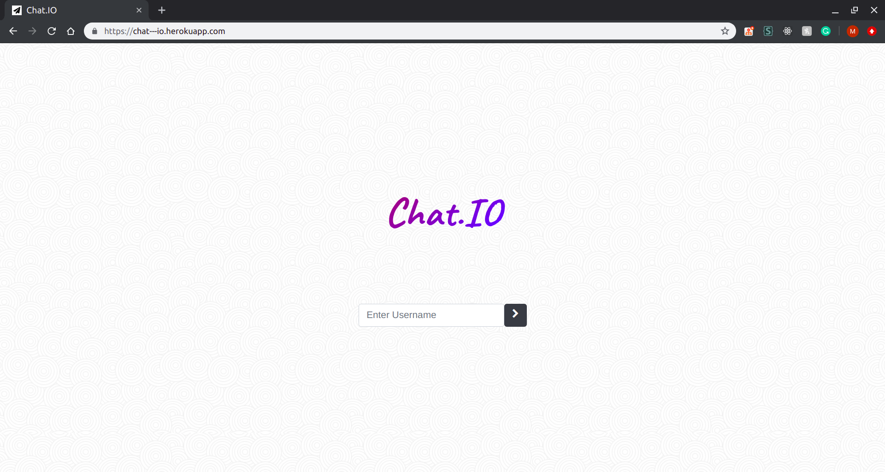
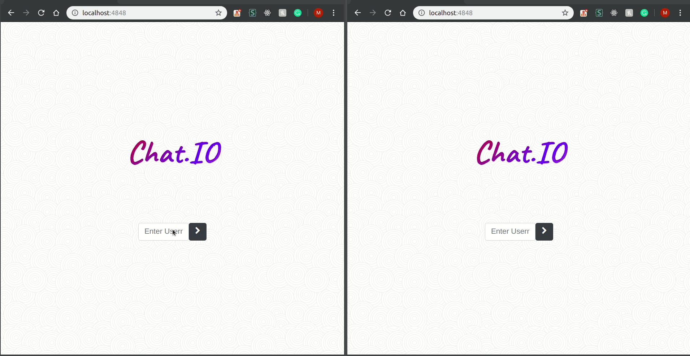
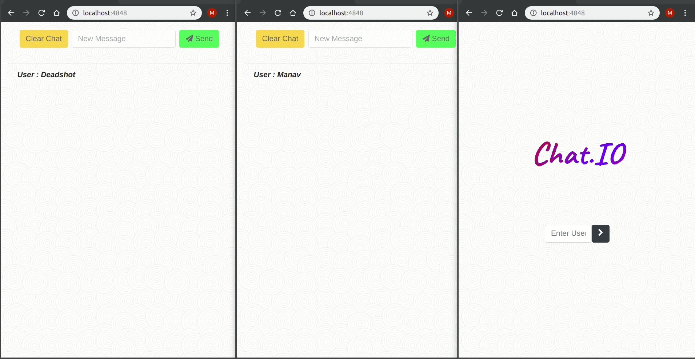

<h1 align="center">Chat.IO</h1>
<h3 align="center">A real time Chat Application</h3>
<p>

  
  <a href="https://github.com/vmanav/Chat.IO#readme" target="_blank">
    
  </a>
  <a href="https://github.com/vmanav/Chat.IO/graphs/commit-activity" target="_blank">
    
  </a>
  <a href="https://github.com/vmanav/Chat.IO/blob/master/LICENSE" target="_blank">
    
  </a>
  
</p>

### 🏠 [Homepage](https://github.com/vmanav/Chat.IO#readme)

## About the Project

Chat.IO is a Node.js and  Socket.IO based real time chat application.
<br/>
The functionalities supported are stated below :

```
- Real Time Chat.
- Public and Private Messaging.
- Encrypted Chats.
- User Entering/Leaving Channel Notifications to all users.
```
## Usage

### Prerequisites 

* Node.js installed

### Setup

1. Fork the repository and clone it to your local machine.
1. Install Dependencies
    ```sh
    npm i
    ```
1. Start the application
    ```sh
    npm start
1. The application is live at http://localhost:4848.

---

## Gallery

||
|:-------:|
|*Landing Page*|

|*Basic Usage*|

|*Private Messaging*|

|*Encrypted Chats*|


## Author

👤 **Manav Verma**

* Github: [@vmanav](https://github.com/vmanav)

## 🤝 Contributing

Contributions, issues and feature requests are welcome!<br />Feel free to check [issues page](https://github.com/vmanav/Chat.IO/issues).

## Show your support

Give a ⭐️ if this project helped you!

## 📝 License

Copyright © 2019 [Manav Verma](https://github.com/vmanav).<br />
This project is [MIT](https://github.com/vmanav/Chat.IO/blob/master/LICENSE) licensed.

***
